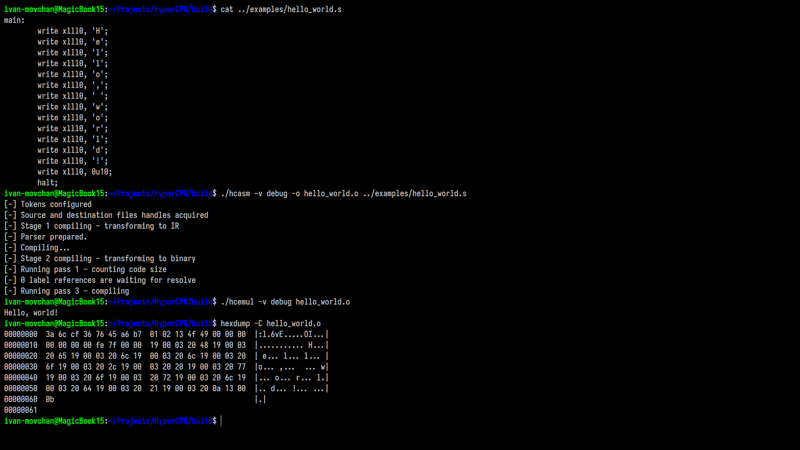

<div align="center">
    
    <h1>HyperCPU</h1>
    <p>
        <a href="https://github.com/HyperWinX/HyperCPU/issues"></a>
        
        
        
        
        
    </p>
</div>

HyperCPU is a set of programs created to work with my own simple ISA (instruction set architecture). The project was created for fun, but it took a lot of time (and nerves), and I learned a lot while working on it.

HyperCPU project includes:
* **hCPU emulator** (aka `hcemul`);
* **hASM assembler** (aka `hcasm`);
* ~~**hASM disassembler**~~ (planned).

See [ROADMAP.md](ROADMAP.md) for project ideas and tasks.

>[!IMPORTANT]
> HyperCPU is almost ready for use! Wait for 1.0 release to try it out or build the project yourself, test it and report issues.



### Installation

>[!WARNING]
> HyperCPU supports GNU/Linux systems only. It is known to be successfully built on `x86_32`, `x86_64` and `ARMv8` architectures.
>
> HyperCPU fails to build and/or work properly under \*BSD systems ­— please do not ask us for support of these systems. Windows support is also not planned.

#### Binaries

Pre-compiled binaries are currently not available. Sorry.

#### Building from sources

Building HyperCPU requires these dependencies to be installed:

* GCC `>=12` or Clang `>=14`;
* GNU make (required for documentation).
* Bazel `>=8.2.1` (recommended using Bazelisk for installation).
* Python `>=3.6` with additional modules:
    * `conan` (should be installed with `--break-system-packages` flag);
    * `sphinx` and `sphinx-rtd-theme` (required for documentation).

After installing dependencies build the project by executing these commands:

```bash
git clone --recursive https://github.com/HyperCPU-Project/HyperCPU # Clone the repository.
cd HyperCPU
conan profile detect && conan install . --build=cmake --build=missing # Download and compile dependencies.
bazel build //src/... --config=linux-opt # Build the project.
ln -s bazel-bin/src/Assembler/hcasm hcasm # Make symlink to hcasm.
ln -s bazel-bin/src/Emulator hcemul # Make symlink to hcemul.
```

Building documentation should not be hard too:

```
cd docs
make html
```

After building documentation open `docs/_build/html/index.html` and start reading.

### Usage

Check out [examples](examples) folder for interesting code examples that will help you better understand the syntax of hASM and the power of HyperCPU.

#### `hcasm` (hASM assembler)

```bash
$ ./hcasm [-h | --help] [--version] [-o VAR] [-c] [-V VAR] source
```

* `source` — source code file to be compiled.
* `-h`, `--help` — display help message and exit.
* `--version` — display program version and exit.
* `-o VAR` — specify output binary file name.
* `-c` — generate an object file.
* `-V VAR` — specify verbosity level (`debug`, `info`, `warning`, `error`). Default value is `warning`.

#### `hcemul` (hCPU emulator)

```bash
$ ./hcemul [-h | --help] [--version] [-v VAR] [-m | --memory VAR] binary
```

* `binary` — binary file to be executed.
* `-h`, `--help` — display help message and exit.
* `--version` — display program version and exit.
* `-v VAR` — specify verbosity level (`debug`, `info`, `warning`, `error`). Default value is `warning`.
* `-m` (`--memory`) `VAR` — specify max. memory amount to be used. Postfixes are supported. Default value is `8K`.

### Contributing

See [CONTRIBUTING.md](CONTRIBUTING.md) for contributing guidelines.

### Authors

HyperCPU is brought to you by these wonderful people:

* **[HyperWin](https://github.com/HyperWinX)** — project founder, lead developer and documentation author.
* **[Ivan Movchan](https://github.com/ivan-movchan)** — project artist, tester, code examples author and just a contributor.
* **[AshFungor](https://github.com/AshFungor)** — just a good contributor :)

### License

HyperCPU is free software released under the terms of the [GNU General Public License v3.0](LICENSE).
